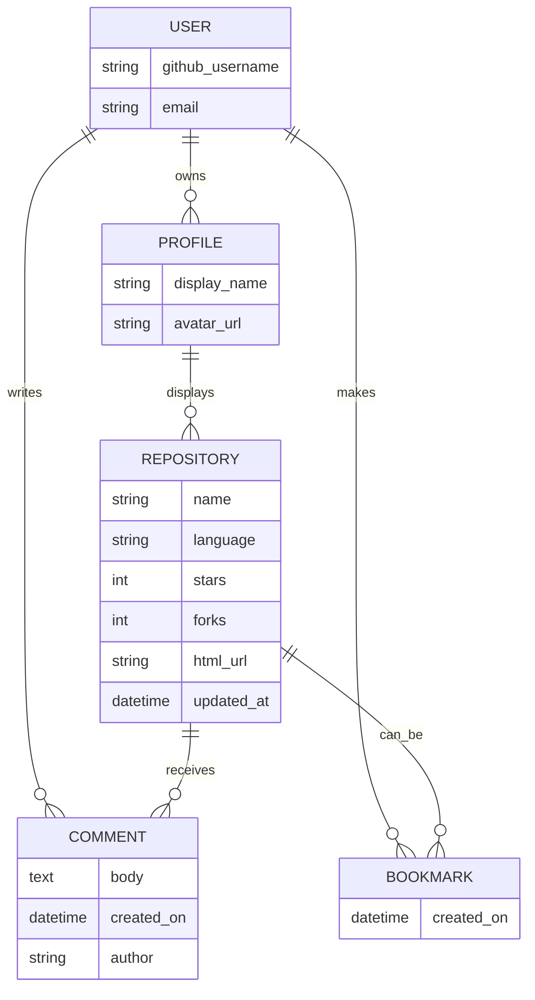

# [GitShowcase.dev](https://gitshowcase-dev-a0b7673e36ce.herokuapp.com)

Developer: Colm Woods ([colmwoods](https://www.github.com/colmwoods))

[](https://www.github.com/colmwoods/GitShowcase.dev/commits/main)
[](https://www.github.com/colmwoods/GitShowcase.dev/commits/main)
[](https://www.github.com/colmwoods/GitShowcase.dev)
[](https://gitshowcase-dev-a0b7673e36ce.herokuapp.com)

## Project Introduction and Rationale

**GitShowcase.dev** is a Django web application that transforms a developer’s public GitHub profile into a clean, interactive portfolio. Users authenticate via **GitHub OAuth**, and the app automatically fetches and presents repositories with rich metadata (language, stars, forks, last updated). Each repository is displayed as an interactive card with actions to **View**, **Download**, **Fork**, **Star/Unstar (toggle)**, **Bookmark**, and **Comment**.

The platform aims to help developers (students, juniors, open‑source contributors) communicate their work quickly and professionally, while giving **recruiters** and **visitors** a frictionless way to browse projects and gauge activity. I built GitShowcase.dev to solve my own pain point—maintaining a portfolio by hand—and to demonstrate full‑stack engineering with real OAuth, API consumption, and user interaction.


source: [GitShowcase.dev amiresponsive](https://ui.dev/amiresponsive?url=https://gitshowcase-dev-a0b7673e36ce.herokuapp.com)

---

## UX

### The 5 Planes of UX

#### 1. Strategy

**Purpose**
- Give developers an elegant, automated portfolio based on their GitHub repos.
- Help recruiters and visitors quickly evaluate a developer’s projects and activity.
- Encourage engagement through bookmarking and commenting.

**Primary User Needs**
- **Developers:** connect GitHub, display repos automatically, interact with feedback.
- **Recruiters/Visitors:** search developers, scan project cards, download/fork/view quickly.
- **All users:** clear visual feedback (e.g., Star ⇄ Starred toggle).

**Business Goals**
- Provide a professional portfolio showcase that is fast and intuitive.
- Support discovery via search and encourage interaction.
- Demonstrate a production‑style Django app with OAuth and GitHub API.

#### 2. Scope

**Feature Scope**
- GitHub OAuth login/logout.
- Automatic repo fetching & display with counts and update timestamps.
- Per‑repo actions: **View**, **Download**, **Fork**, **Star/Unstar**, **Bookmark**, **Comment**.
- Search for other developers’ profiles.
- About page for project/author context.
- Custom 404 page for invalid routes.
- Responsive UI with status chips (language, updated date).

**Content Requirements**
- Profile header (GitHub username, avatar when available).
- Repository metadata and action buttons.
- Comment threads with owner‑only Edit/Delete.

#### 3. Structure

**Information Architecture**
- **Nav:** Home • Search • About • Login/Logout
- **Key Screens:** Home (your repos), Profile view (for searched users), About, 404.

**User Flow**
1. Login with GitHub OAuth.
2. Your repos are fetched and rendered as cards.
3. Use per‑card actions (View, Download ZIP, Fork on GitHub, Star/Unstar toggle, Bookmark, Comment).
4. Search other users (e.g., `?q=colmwoods`) and open their profile cards.
5. Read About for context; invalid URLs show the custom 404 page.

#### 4. Skeleton

Wireframes were produced for mobile, tablet, and desktop to ensure clarity and responsiveness.

| Page | Mobile | Tablet | Desktop |
| --- | --- | --- | --- |
| Home |  |  |  |
| Profile |  |  |  |
| Search |  |  |  |
| About |  |  |  |
| 404 |  |  |  |

#### 5. Surface

**Colour Scheme**

Palette from [coolors.co](https://coolors.co/080708-3772ff-df2935-fdca40-e6e8e6):

- `#080708` — Background
- `#3772FF` — Primary accent
- `#DF2935` — Errors / warning accents
- `#FDCA40` — Highlights
- `#E6E8E6` — Muted text / borders


**Typography**
- [Montserrat](https://fonts.google.com/specimen/Montserrat) — headings
- [Lato](https://fonts.google.com/specimen/Lato) — body
- [Font Awesome](https://fontawesome.com) — icons

---

## User Stories

| Target | Expectation | Outcome |
| --- | --- | --- |
| As a developer | I want to log in using GitHub OAuth | so that I can connect my account securely. |
| As a developer | I want my repositories to display automatically | so that I don’t need to maintain a portfolio manually. |
| As a developer | I want to bookmark interesting repositories | so that I can revisit them later. |
| As a user | I want to download repositories as ZIPs | so that I can inspect code locally. |
| As a user | I want to fork repositories | so that I can contribute or experiment on GitHub. |
| As a user | I want to star/ unstar with clear visual feedback | so that I know whether a repo is Starred or not. |
| As a user | I want to leave comments on repos | so that I can give feedback or ask questions. |
| As a user | I want to edit or delete my own comments | so that I can correct or remove them if needed. |
| As a visitor | I want to search by GitHub username | so that I can view other developers’ profiles. |
| As a visitor | I want to read an About page | so that I understand the project’s purpose and author background. |
| As a visitor | I want a helpful 404 page | so that I’m guided when I hit an invalid URL. |

---

## Features

### Existing Features

| Feature | Notes | Screenshot |
| --- | --- | --- |
| GitHub OAuth Login | Secure authentication using GitHub. |  |
| Repository Cards | Name, language chip, star/fork counts, last updated. |  |
| Actions: View | Opens the repository on GitHub. |  |
| Actions: Download | Downloads repository as `.zip`. |  |
| Actions: Fork | Links directly to GitHub’s Fork flow. |  |
| Actions: Star / Starred (toggle) | Button text toggles between **Star** and **Starred** after the action so users immediately see the result. |  |
| Bookmark | Saves repos to a personal list within GitShowcase. |  |
| Comments | Add comments; owners can **Edit**/**Delete** their own. Comment count is shown on the card. |  |
| Search | Search other developers by GitHub username, e.g. `?q=colmwoods`. |  |
| About Page | Explains the app’s purpose and credits. |  |
| 404 Page | Custom error page for invalid routes. |  |
| Responsive UI | Optimized for mobile, tablet, and desktop using Bootstrap. |  |
| Heroku Deployment | Live production deployment. |  |

### Future Features

- Profile customization (bio, avatar, pinned repos).
- Sorting & filtering (by language, stars, update date).
- Theme toggle (light/dark).
- Recruiter tools (saved profiles, notes).
- Email notifications for new comments.
- Basic analytics (views, clicks).

---

## Tools & Technologies

| Tool / Tech | Use |
| --- | --- |
| [Git](https://git-scm.com) | Version control |
| [GitHub](https://github.com) | Hosting, issues, pull requests |
| [VSCode](https://code.visualstudio.com) | IDE |
| [HTML](https://en.wikipedia.org/wiki/HTML) | Structure |
| [CSS](https://en.wikipedia.org/wiki/CSS) | Styling |
| [JavaScript](https://www.javascript.com) | Interactivity |
| [Bootstrap](https://getbootstrap.com) | Responsive layout |
| [Python](https://www.python.org) | Backend language |
| [Django](https://www.djangoproject.com) | Web framework |
| [PostgreSQL](https://www.postgresql.org) | Database |
| [Heroku](https://www.heroku.com) | Deployment |
| [Font Awesome](https://fontawesome.com) | Icons |
| [ChatGPT](https://chat.openai.com) | Docs & debugging support |

---

## Database Design

High‑level entities and relations used by the app.



---

## Agile Development Process

### GitHub Projects

[GitHub Projects](https://www.github.com/colmwoods/GitShowcase.dev/projects) used for Kanban, epics, user stories, and milestones.


### GitHub Issues

| Link | Screenshot |
| --- | --- |
| [](https://www.github.com/colmwoods/GitShowcase.dev/issues?q=is%3Aissue%20is%3Aopen) |  |
| [](https://www.github.com/colmwoods/GitShowcase.dev/issues?q=is%3Aissue%20is%3Aclosed) |  |

### MoSCoW Prioritization

- **Must Have:** OAuth, repo cards, search, star/bookmark/comment, 404.
- **Should Have:** downloads, forks, responsive design polish.
- **Could Have:** profiles, analytics, theming.

---

## Testing

All manual/automated testing details are documented in **[TESTING.md](TESTING.md)** (accessibility, responsiveness, form validation, auth, 404 handling, and error states).

---

## Deployment

Live: **[gitshowcase-dev-a0b7673e36ce.herokuapp.com](https://gitshowcase-dev-a0b7673e36ce.herokuapp.com)**

### Heroku Setup
1. Create a Heroku app and connect GitHub repo.
2. Set **Config Vars**:
   - `DATABASE_URL` — PostgreSQL URL
   - `SECRET_KEY` — Django secret
   - `GITHUB_CLIENT_ID` — OAuth client ID
   - `GITHUB_CLIENT_SECRET` — OAuth client secret
   - *(optional)* `DISABLE_COLLECTSTATIC=1` during early deploys
3. Push to `main`; enable automatic deploys if desired.

### Required Files
- `requirements.txt`
- `Procfile` (e.g., `web: gunicorn <django_project>.wsgi`)
- `.python-version` (e.g., `3.12`)

### Local Development
```bash
git clone https://www.github.com/colmwoods/GitShowcase.dev.git
cd GitShowcase.dev
pip3 install -r requirements.txt
# create env.py with SECRET_KEY, DATABASE_URL, GITHUB_CLIENT_ID, GITHUB_CLIENT_SECRET
python3 manage.py migrate
python3 manage.py runserver
```
Visit `http://localhost:8000`.

### Cloning
1. Go to the [repository](https://www.github.com/colmwoods/GitShowcase.dev).
2. Click **Code** → copy URL (HTTPS/SSH/CLI).
3. In your terminal: `git clone https://www.github.com/colmwoods/GitShowcase.dev.git`.

### Forking
1. Open the repo on GitHub.  
2. Click **Fork** to create your copy.

### Local vs Deployment
No significant feature differences; environment configs differ (keys, database URL).

---

## Credits

### Content
- [GitHub REST API](https://docs.github.com/en/rest) — repository data retrieval.
- [Bootstrap](https://getbootstrap.com) — layout/components.
- [Font Awesome](https://fontawesome.com) — icons.
- [Markdown Builder](https://markdown.2bn.dev) — README scaffolding help.
- [ChatGPT](https://chat.openai.com) — documentation and troubleshooting assistance.

### Media
- [favicon.io](https://favicon.io) — favicon.
- [Unsplash](https://unsplash.com) — placeholder images.

### Acknowledgements
- Thanks to my Code Institute mentor **Tim Nelson** and the CI Tutor/Slack community.
- Thanks to my partner for ongoing support.