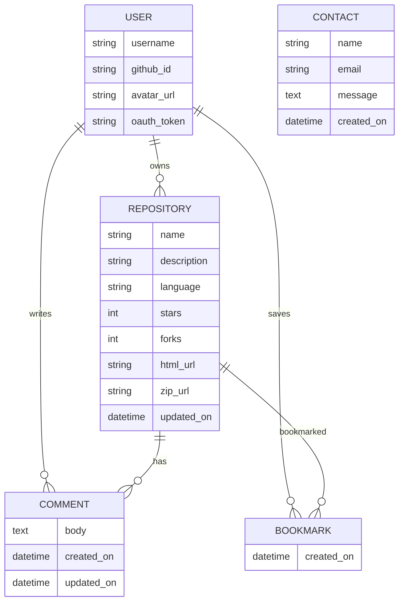

# [GitShowcase.dev](https://gitshowcase-dev-a0b7673e36ce.herokuapp.com)

Developer: Colm Woods ([colmwoods](https://www.github.com/colmwoods))

[](https://www.github.com/colmwoods/GitShowcase.dev/commits/main)
[](https://www.github.com/colmwoods/GitShowcase.dev/commits/main)
[](https://www.github.com/colmwoods/GitShowcase.dev)
[](https://gitshowcase-dev-a0b7673e36ce.herokuapp.com)

# Project Introduction And Rationale

GitShowcase.dev is a platform designed for developers to present, explore, and interact with GitHub repositories in a clean, structured, and user-friendly interface. While GitHub provides powerful developer tooling, GitShowcase.dev focuses on enhancing *presentation*, *readability*, and *discoverability* — giving users a portfolio-style experience without requiring them to manually curate content.

This project was created to solve a real personal need:  
Developers, including myself, often want a cleaner way to show off their repositories — something more visually appealing and easy to browse than GitHub’s native interface. GitShowcase.dev acts as a dedicated hub where users can authenticate with GitHub, browse all their repositories, bookmark favourites, view metadata, and interact via commenting and more.

It is both a portfolio viewer and a GitHub enhancement tool.

**Target audience:**
- Developers who want a cleaner interface to showcase their work.
- Recruiters browsing developer projects.
- Students building GitHub-based portfolios.
- Anyone who wants an easier way to search and view GitHub user profiles.

**Why I chose this project:**  
I wanted to build something useful for myself and for other developers — a tool that enhances GitHub without replacing it. The idea came from seeing many online developer portfolios missing features such as repo metadata, live ZIP downloads, starring, bookmarking, or comments. Combining all these into a single app provided an exciting challenge to improve full-stack Django skills while integrating OAuth, external APIs, and advanced UI features.

---------


Source:  
[GitShowcase.dev amiresponsive](https://ui.dev/amiresponsive?url=https://gitshowcase-dev-a0b7673e36ce.herokuapp.com)

---------

# UX

## The 5 Planes of UX

### 1. Strategy

**Purpose**
- Provide developers with a clean, centralised space to present their GitHub repositories.
- Allow users to interact with repos by bookmarking, starring, downloading ZIPs, and commenting.
- Enable a simple way to browse other GitHub users and explore their repositories.
- Make developer portfolios easier to view and share.

**Primary User Needs**
- Developers want a better interface to showcase and manage their repos.
- Visitors want an easy way to navigate someone's repository portfolio.
- Users want to be able to comment, bookmark, and star repos without technical difficulty.
- Recruiters want an organised, visually easy-to-read layout when viewing developer profiles.

**Business Goals**
- Provide a value-added interface on top of the GitHub API.
- Become a simple “developer landing page” alternative to traditional portfolios.
- Encourage interaction through comments, bookmarks, and repo discovery.
- Create a platform that can grow with additional GitHub integrations in the future.

### 2. Scope

**Features (see full Features section below)**  
GitShowcase.dev includes:
- GitHub OAuth login
- Fetching repositories automatically from the GitHub API
- Repository detail pages
- Bookmarks system
- Comment system with edit/delete
- Star/unstar functionality
- Fork links
- ZIP downloads
- Search GitHub users
- About page
- Contact form
- 404 handling

**Content Requirements**
- Repository metadata (languages, descriptions, stars, forks)
- User profile information (avatar, GitHub username)
- Comments per repository
- Contact messages stored in DB
- Paginated browsing for large repo lists
- Bookmarking stored per authenticated user

### 3. Structure

**Information Architecture**

**Navigation Menu**
- Home
- Bookmarks
- Search Users
- About
- Contact
- Login with GitHub / Logout

**User Flow**
1. User arrives on homepage → views their GitHub repositories.
2. User logs in via GitHub OAuth.
3. User browses repositories with detailed metadata.
4. User bookmarks repos, stars them, downloads ZIPs, or views repo details.
5. User can add/edit/delete comments.
6. User can search for other GitHub users and browse their repos.
7. Guests can browse publicly available repos but cannot comment or bookmark.

### 4. Skeleton

See **Wireframes** section.

### 5. Surface

See **Colour Scheme** and **Typography** sections.

---------

## Colour Scheme

I used [coolors.co](https://coolors.co) to generate a palette suitable for a clean, modern developer interface.

Palette Example:

- **Background Gradient:** `#0a1a2f` → `#122b45`  
- **Primary Accent:** `#00bfff`  
- **Secondary Accent:** `#0077ff`  
- **Success:** `#28a745`  
- **Warning:** `#ff7b00`  
- **Info:** `#6f42c1`  
- **Danger:** `#dc3545`   


---------

## Typography

GitShowcase.dev uses the following:

- **Montserrat** — for headers  
  https://fonts.google.com/specimen/Montserrat  
- **Lato** — for body text  
  https://fonts.google.com/specimen/Lato  
- **Font Awesome** — for icons  
  https://fontawesome.com  

---

## Wireframes
To ensure consistent design and usability across all device sizes, wireframes were created for **mobile**, **tablet**, and **desktop** using [Balsamiq](https://balsamiq.com/wireframes).

| Page | Mobile | Tablet | Desktop |
| --- | --- | --- | --- |
| **Home (Repo List)** |  |  |  |
| **Comments / Repo Detail** |  |  |  |
| **Bookmarks** |  |  |  |
| **Search Users** |  |  |  |
| **Login** |  |  |  |
| **About** |  |  |  |
| **Contact** |  |  |  |
| **404** |  |  |  |

---

# User Stories

GitShowcase.dev user stories are divided into developer (site user), visitors, and administrative stories.

| Target | Expectation | Outcome |
| --- | --- | --- |
| As a developer | I want to log in with GitHub OAuth | so I can securely access my repositories. |
| As a developer | I want to browse all of my GitHub repositories | so I can showcase my work in one place. |
| As a developer | I want to click a repository to view more details | so I can show metadata like languages, stars, forks. |
| As a developer | I want to star/unstar a repository | so I can interact with GitHub directly. |
| As a developer | I want to download a repository ZIP | so I can quickly obtain project files. |
| As a developer | I want to bookmark repositories | so I can save my favourite or most important projects. |
| As a developer | I want to remove bookmarks | so I can manage what I keep saved. |
| As a developer | I want to comment on repositories displayed on the platform | so I can add notes, updates, or discussions. |
| As a developer | I want to edit or delete my comments | so I can fix mistakes or remove text. |
| As a visitor | I want to search GitHub users | so I can browse other developers' profiles. |
| As a visitor | I want to view other users’ repositories | so I can explore profiles. |
| As a visitor | I want to view repository details | so I can learn more about a project. |
| As a visitor | I want to view comments on a repo | so I can see discussions and feedback. |
| As a visitor | I want to access an About page | so I can learn what GitShowcase.dev does. |
| As a visitor | I want to submit a contact form | so I can reach out to the site owner. |
| As a user | I want a 404 page | so I understand if I access an invalid URL. |

---

# Features

## Existing Features

### GitHub OAuth Login
- Users authenticate exclusively via GitHub.
- No local registration or password system is used.
- The login process retrieves username and avatar from GitHub.

### Repository List (Homepage)
- Automatically loads all public repositories belonging to the authenticated user.
- Displays repo name, description, stars, last updated date, language, and buttons for interaction.

### Repository Detail Page
- Shows full metadata: stars, forks, languages, readme link, view on GitHub.
- Includes comments, bookmarks, download, and star/unstar actions.

### Bookmarks
- Users can bookmark any repository.
- Bookmarks are saved in the Django database.
- Bookmarks appear on a dedicated page sorted by name.

### Comments
- Users can add comments to any repository.
- Users can edit their comments.
- Users can delete their own comments.
- Comments are stored locally (not on GitHub).

### Star / Unstar Repositories
- Users can star/unstar repos directly through the GitHub API.

### ZIP Download
- Users can download the ZIP archive of any repository.

### Fork Redirect
- Fork button takes the user to GitHub’s official fork page.

### User Search
- Users can search for any GitHub username.
- Displays that user's public repositories.

### About Page
- Explains the purpose of GitShowcase.dev.
- Shows developer information.

### Contact Form
- Visitors can send a message via a form.
- Messages are stored in the Contact model.
- Admin can view submissions in Django admin.

### 404 Page
- Custom 404 page matching the GitShowcase.dev branding.

---

## Features Table with Screenshots

| Feature | Notes | Screenshot |
| --- | --- | --- |
| Login with GitHub | OAuth-only login flow |  |
| Logout | Ends authenticated session |  |
| Repository List | Shows all repos from GitHub API |  |
| Repo Detail View | Metadata, actions, comments |  |
| Bookmark Repo | Saves to DB |  |
| Remove Bookmark | Removes from DB |  |
| Add Comment | Add repo comments |  |
| Edit Comment | Edit your own comments |  |
| Delete Comment | Delete your own comments |  |
| Star Repo | GitHub API star |  |
| Unstar Repo | GitHub API unstar |  |
| Download ZIP | Gets ZIP from GitHub |  |
| Search GitHub Users | Explore other developers |  |
| About Page | Info about site |  |
| Contact Form | Messages stored in DB |  |
| Custom 404 | Styled error page |  |

## Future Features

- **Private Repository Support**  
  Allow authenticated users to opt-in to include private repositories in their showcase.

- **Pinned Repositories**  
  Let users “pin” repos to the top of their showcase, similar to GitHub profiles.

- **Tagging & Categories**  
  Users could create custom tags (e.g., “Python”, “Portfolio”, “Machine Learning”) to group repos.

- **Project Analytics**  
  Track repository views, comment activity, and popularity trends inside GitShowcase.dev.

- **Follow Other Developers**  
  Ability to “follow” GitShowcase.dev users and create a feed of recent updates.

- **AI Summary of Repositories**  
  Auto-generate summaries/descriptions of repositories using OpenAI or similar APIs.

- **Comment Threads**  
  Nested comment replies for more structured conversations.

- **Dark / Light Mode Toggle**  
  Fully dynamic theming options.

- **Custom Profile Page**  
  Users could add bios, custom links, pinned repos, and featured projects.

- **Notifications**  
  Notify users when someone comments on a repo or replies to them.

- **Social Sharing**  
  Share repository showcase pages to Twitter, LinkedIn, etc.

---

## Tools & Technologies

| Tool / Tech | Use |
| --- | --- |
| [](https://markdown.2bn.dev) | Generate Markdown templates. |
| [](https://git-scm.com) | Version control (`git add`, `git commit`, `git push`). |
| [](https://github.com) | Source hosting, Issues, Projects, OAuth. |
| [](https://code.visualstudio.com) | Local development environment. |
| [](https://developer.mozilla.org/en-US/docs/Web/HTML) | Page structure and layout. |
| [](https://developer.mozilla.org/en-US/docs/Web/CSS) | Styling and design. |
| [](https://developer.mozilla.org/en-US/docs/Web/JavaScript) | Client-side interaction. |
| [](https://www.python.org) | Backend logic. |
| [](https://www.djangoproject.com) | Backend framework powering the application. |
| [](https://django-allauth.readthedocs.io) | GitHub OAuth authentication. |
| [](https://docs.github.com/en/rest) | Fetching repos, metadata, starring/un-starring. |
| [](https://requests.readthedocs.io/en/latest/) | Handling GitHub API calls. |
| [](https://www.postgresql.org) | Relational database. |
| [](https://getbootstrap.com) | Responsive UI structure. |
| [](https://fontawesome.com) | Icon set used across the site. |
| [](https://www.heroku.com) | Production deployment. |
| [](https://shields.io) | README badges. |
| [](https://cloudinary.com) | Optional static/media hosting. |
| [](https://stackoverflow.com) | Debugging assistance. |
| [](https://chat.openai.com) | Troubleshooting, logic explanation, workflow guidance. |

---

# Database Design

## Data Model

GitShowcase.dev uses a relational database powered by **PostgreSQL**, following a clean and maintainable schema aligned with Django’s ORM conventions.

The core data structure consists of several Django models that handle:
- User accounts (via GitHub OAuth)
- Repository metadata (cached from the GitHub API)
- User comments on repositories
- Bookmark functionality
- Contact form submissions

These models were planned, structured, and interconnected to ensure efficient queries, scalable growth, and intuitive data relationships throughout the project.

### **User**  
- Username  
- GitHub ID  
- Avatar URL  
- OAuth token (secured)

### **Repository**  
- GitHub repo ID  
- Name  
- Owner  
- Description  
- Stars  
- Forks  
- Language  
- HTML URL  
- ZIP URL  
- Last updated date  

### **Comment**  
- ForeignKey → Repository  
- ForeignKey → User  
- Body  
- Created date  
- Updated date  

### **Bookmark**  
- ForeignKey → User  
- ForeignKey → Repository  
- Created date  

### **Contact**  
- Name  
- Email  
- Message  
- Timestamp  

---

## Mermaid ERD

Below is the interactive ERD generated using Mermaid:



Source:  
https://mermaid.live/

---

## Advanced ERD Generation (Optional)

To generate an advanced system-wide ERD automatically:

Steps followed:

1. `sudo apt update`  
2. `sudo apt-get install python3-dev graphviz libgraphviz-dev pkg-config`  
3. `pip3 install django-extensions pygraphviz`  
4. Add to `INSTALLED_APPS`:
    ```python
    'django_extensions',
    ```
5. Generate ERD:
    ```bash
    python3 manage.py graph_models -a -o erd.png
    ```
6. Move `erd.png` into `documentation/`.
7. Remove django-extensions from installed apps.
8. Uninstall:
    ```bash
    pip3 uninstall django-extensions pygraphviz -y
    ```


# Agile Development Process

## GitHub Projects

GitHub Projects was used as the primary Agile management tool for this project.  
It allowed the work to be broken down into clearly structured Agile components:

- **Epics**  
- **User Stories**  
- **Tasks**  
- **Bugs**

These items were organised using a Kanban workflow with the following columns:

- **To Do**  
- **In Progress**  
- **In Review**  
- **Done**

This system helped track progress throughout development and kept the project aligned with Agile best practices.


**Project Board:**  
https://github.com/users/colmwoods/projects/10

---

## GitHub Issues

GitHub Issues served as the home for:

- User stories  
- Bug tracking  
- Milestone grouping  
- Documentation of acceptance criteria  
- Comments for progress tracking  

| Link | Screenshot |
| --- | --- |
| [](https://www.github.com/colmwoods/GitShowcase.dev/issues?q=is%3Aissue%20is%3Aopen%20-label%3Abug) |  |
| [](https://www.github.com/colmwoods/GitShowcase.dev/issues?q=is%3Aissue%20is%3Aclosed%20-label%3Abug) |  |

---

## MoSCoW Prioritisation

The project used MoSCoW to determine priorities:

### **Must Have**
- GitHub OAuth login  
- Repository listing  
- Repository details  
- Comments CRUD  
- Bookmarks  
- Contact form  
- 404 page  
- Deployment on Heroku  

### **Should Have**
- User search  
- ZIP download  
- Star/unstar functionality  

### **Could Have**
- About page  
- Repo metadata enhancements  
- Icons, UI improvements  

### **Won’t Have (for now)**
- Private repos  
- Following users  
- Notifications  
- AI integrations  

---

# Testing

For all testing documentation, screenshots, validation results, and test case breakdowns, see:

👉 **[TESTING.md](TESTING.md)**

This includes:

- Lighthouse tests  
- Responsiveness tests  
- HTML/CSS/JS/Python validators  
- Heroku deployment testing  
- Manual test cases  
- Automated test details  
- Bugs and solutions  

---

# Deployment

The live deployed application is on **Heroku**:

### 🔗 https://gitshowcase-dev-a0b7673e36ce.herokuapp.com

---

## Heroku Deployment

Heroku was used to deploy GitShowcase.dev as a cloud-hosted Django application.

### Deployment Steps

1. Create a new Heroku app.
2. Add Config Vars from `env.py`.
3. Connect GitHub repository (automatic deployment recommended).
4. Ensure the following files exist:
   - `requirements.txt`
   - `Procfile`
   - `.python-version`
5. Push to GitHub → Heroku auto-builds and deploys.

---

## Heroku Config Vars

The following environment variables must be added to Heroku for the application to run correctly:

| Key | Value |
| --- | --- |
| `DATABASE_URL` | user-inserts-own-postgres-database-url |
| `GITHUB_CLIENT_ID` | user-inserts-own-id |
| `GITHUB_CLIENT_SECRET` | user-inserts-own-secret |
| `SECRET_KEY` | any-random-secret-key |

---

## Required Heroku Files

### requirements.txt  
Install dependencies:

```
pip3 install -r requirements.txt
```

### Procfile

```
web: gunicorn gitshowcase.wsgi
```

### .python-version

```
3.12
```

---

# PostgreSQL

GitShowcase.dev uses a PostgreSQL relational database.

Code Institute PostgreSQL databases were used during development.

⚠️ **Note:**  
These databases:
- Are available only to CI students  
- Auto-delete after 18 months  
- Have a limit of 8 databases  

Connection string example:

```
postgres://<db_username>:<db_password>@<host>/<db_name>
```

Add this to `env.py` and Heroku Config Vars as `DATABASE_URL`.

---

# Local Development

This project can be cloned or forked for local use.

Install dependencies:

```
pip3 install -r requirements.txt
```

A local `env.py` file must be created:

```python
import os

os.environ.setdefault("SECRET_KEY", "any-random-secret-key")
os.environ.setdefault("DATABASE_URL", "user-inserts-own-postgres-database-url")
os.environ.setdefault("GITHUB_CLIENT_ID", "user-inserts-own-id")
os.environ.setdefault("GITHUB_CLIENT_SECRET", "user-inserts-own-secret")

os.environ.setdefault("DEBUG", "True")
```

---

## Running Locally

1. `python3 manage.py runserver`  
2. Stop the server: CTRL+C  
3. `python3 manage.py makemigrations --dry-run`  
4. `python3 manage.py makemigrations`  
5. `python3 manage.py migrate`  
6. `python3 manage.py createsuperuser`  
7. (Optional) Load fixtures  
8. Run server again: `python3 manage.py runserver`

---

# Cloning

1. Visit repo:  
   https://www.github.com/colmwoods/GitShowcase.dev  
2. Click **Code**  
3. Copy HTTPS/SSH/CLI link  
4. In terminal:  
   ```
   git clone https://www.github.com/colmwoods/GitShowcase.dev.git
   ```
5. Press ENTER

Alternatively open in Gitpod using:

[](https://gitpod.io/#https://www.github.com/colmwoods/GitShowcase.dev)

---

## Cloning Directly from GitShowcase.dev (Optional)

GitShowcase.dev provides a convenient “View on GitHub” button on each project card.  
This allows users to quickly access the repository and clone it without navigating GitHub manually.

### Steps:

1. Open **GitShowcase.dev** and navigate to the search bar and type colmwoods:
   https://gitshowcase-dev-a0b7673e36ce.herokuapp.com

2. Locate the project card for **GitShowcase.dev**.

3. Click the **“View”** button.  
   This will open the GitHub repository directly:
   https://www.github.com/colmwoods/GitShowcase.dev

4. Click the **Code** button.

5. Copy the HTTPS / SSH / GitHub CLI link.

6. In your terminal, run:

   ```bash
   git clone https://www.github.com/colmwoods/GitShowcase.dev.git
   ```

7. Press **ENTER** to clone the project locally.

This optional section highlights how GitShowcase.dev itself improves project discoverability and cloning workflows.


---

## Forking

Forking the repository allows you to make a personal copy of the project on your own GitHub account.  
This is useful if you want to experiment, contribute, or build on the project without affecting the original repository.

### Steps:

1. Log in to your GitHub account.
2. Visit the project repository:  
   https://www.github.com/colmwoods/GitShowcase.dev
3. In the top-right corner, click the **Fork** button.
4. GitHub will create a full copy of the repository under your account.
5. You can now clone your fork, make changes, and push updates safely.


---

## Forking from GitShowcase.dev (Optional)

GitShowcase.dev provides a direct GitHub link on each project card, making it easy for users to fork your project without manually searching for it on GitHub.

### Steps:

1. Open **GitShowcase.dev** and navigate to the search bar and type colmwoods:  
   https://gitshowcase-dev-a0b7673e36ce.herokuapp.com

2. Find the project card for **GitShowcase.dev**.

3. Click the **Fork** button.

4. GitHub will create a copy of the repository under your account, which you can:

   - modify  
   - push changes to  
   - open pull requests from  

This highlights how GitShowcase.dev streamlines project discovery and developer workflows.

---

# Local VS Deployment

There are **no major differences** between the local version and the deployed Heroku version.

Both behave identically.

# Credits

This section lists all resources, references, tools, libraries, and external materials used throughout the creation of GitShowcase.dev. Citations are important to avoid plagiarism and to give credit to creators and contributors whose materials supported this project.

---

## Content Credits

| Source | Notes |
| --- | --- |
| [Markdown Builder](https://markdown.2bn.dev) | Assisted in structuring initial Markdown templates. |
| [GitHub REST API Docs](https://docs.github.com/en/rest) | Used to implement repo fetching, starring, and ZIP download features. |
| [Django Documentation](https://docs.djangoproject.com) | General backend references. |
| [Chris Beams – How to Write a Commit Message](https://chris.beams.io/posts/git-commit) | Guided commit message conventions. |
| [I Think Therefore I Blog](https://codeinstitute.net) | CI walkthrough project used for formatting and feature structure inspiration only. |
| [Bootstrap](https://getbootstrap.com) | Base styles, layout, and responsive components. |
| [Font Awesome](https://fontawesome.com) | Icons across navbar, buttons, and repo cards. |
| [Cloudinary](https://cloudinary.com) | Potential optional hosting for images. |
| [Whitenoise](https://whitenoise.readthedocs.io) | Used for static file management in deployment. |
| [GitHub OAuth Apps](https://github.com/settings/developers) | Used for GitHub OAuth integration setup. |
| [StackOverflow](https://stackoverflow.com) | Troubleshooting numerous API and Django issues. |
| [Python Tutor](https://pythontutor.com) | Helped understand complex logic flow during backend validation. |
| [ChatGPT](https://chatgpt.com) | Troubleshooting, explanations, code reviews, and guidance on API usage. |

---

## Media Credits

| Source | Notes |
| --- | --- |
| [favicon.io](https://favicon.io) | Used to generate favicon. |
| [Font Awesome](https://fontawesome.com) | Icons for navigation and repo metadata. |
| [Pexels](https://pexels.com) | Placeholder images in development. |
| [Unsplash](https://unsplash.com) | Additional placeholder images. |
| [Wallhere](https://wallhere.com) | Background wallpaper options. |
| [Pixabay](https://pixabay.com) | Additional free-use image assets. |
| [DALL·E 3](https://openai.com/index/dall-e-3) | AI-generated artwork for optional illustrated assets. |
| [TinyPNG](https://tinypng.com) | Compression of images under 5 MB. |
| [CompressPNG](https://compresspng.com) | Compression of images over 5 MB. |
| [CloudConvert](https://cloudconvert.com/webp-converter) | Conversion of image assets to `.webp` formats. |

All stock images used were license-free and eligible for reuse.

---

# Acknowledgements

- I would like to thank my Code Institute mentor, [Tim Nelson](https://www.github.com/TravelTimN) for the support throughout the development of this project.
- I would like to thank the [Code Institute](https://codeinstitute.net) Tutor Team for their assistance with troubleshooting and debugging some project issues.
- I would like to thank the [Code Institute Slack community](https://code-institute-room.slack.com) and [Code Institute Discord community](https://discord-portal.codeinstitute.net) for the moral support; it kept me going during periods of self doubt and impostor syndrome.
- I would like to thank my partner, for believing in me, and allowing me to make this transition into software development.
- I would like to thank my employer, for supporting me in my career development change towards becoming a software developer.

---